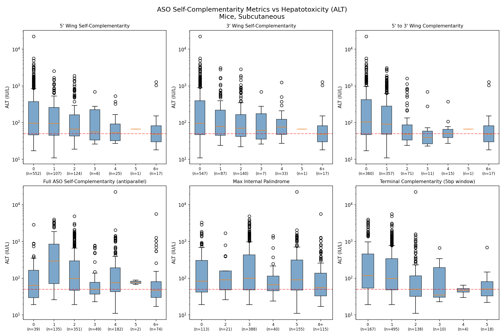
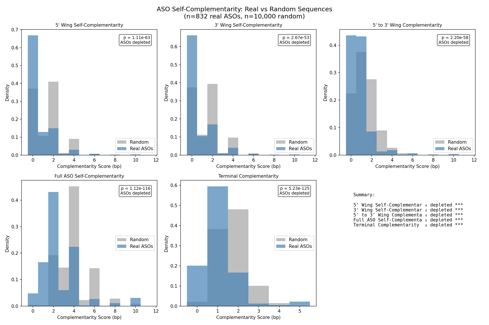

# Hypothesis 001: Wing Self-Complementarity and Hepatotoxicity

## Hypothesis

ASOs with higher 5' wing self-complementarity form homodimers more readily, leading to altered protein binding and increased hepatotoxicity (elevated ALT).

## Rationale

Crystal structure 6YCS shows two phosphorothioate ASOs (PS-ASOs) dimerizing via their 5' wings. If wings with higher self-complementarity can form more stable dimers, this could:
1. Alter pharmacokinetics (e.g., reduced cellular uptake)
2. Change protein binding profiles
3. Lead to toxic aggregates in hepatocytes

## Literature

The 6YCS structure (Crooke et al.) demonstrates wing-mediated ASO dimerization:
- Two MOE-gapmer ASOs align antiparallel
- 5' wings form base-paired interface
- Suggests sequence-dependent dimerization potential

## Methods

### Dataset
- **Source**: `data/oligostack/processed/hepatictoxicity_processed.parquet`
- **Filter**: Mouse, subcutaneous administration
- **N**: 832 unique ASOs with valid HELM and ALT

### Metrics Tested
Six complementarity metrics were calculated:

1. **5' Wing Self-Complementarity**: Max contiguous bp when 5' wing pairs with its own reverse complement
2. **3' Wing Self-Complementarity**: Same for 3' wing
3. **5' to 3' Wing Complementarity**: One molecule's 5' wing binding another's 3' wing
4. **Full ASO Self-Complementarity**: Entire sequence dimerizing antiparallel
5. **Max Internal Palindrome**: Longest palindromic region
6. **Terminal Complementarity**: 5' end pairing with 3' end (5bp window)

### Statistics
- Spearman correlation (metric vs ALT)
- Mann-Whitney U at thresholds (≥3bp vs <3bp, ≥4bp vs <4bp)

## Results

### Summary Table

| Metric | Spearman ρ | p-value | Direction |
|--------|------------|---------|-----------|
| **Full ASO Self-Complementarity** | **-0.250** | **2.8e-13** | ↓ ALT |
| **Terminal Complementarity** | **-0.217** | **2.3e-10** | ↓ ALT |
| **5' to 3' Wing Complementarity** | **-0.158** | **4.4e-06** | ↓ ALT |
| 5' Wing Self-Complementarity | -0.130 | 1.6e-04 | ↓ ALT |
| 3' Wing Self-Complementarity | -0.130 | 1.6e-04 | ↓ ALT |
| Max Internal Palindrome | -0.102 | 3.3e-03 | ↓ ALT |

### Mann-Whitney U (Full ASO Self-Complementarity)

| Comparison | High (n) | Median ALT | Low (n) | Median ALT | p-value |
|------------|----------|------------|---------|------------|---------|
| ≥3bp vs <3bp | 307 | 63 IU/L | 525 | 115 IU/L | 1.0e-10 |
| ≥4bp vs <4bp | 258 | 66 IU/L | 574 | 102 IU/L | 7.8e-07 |

### Visualization

## Random Baseline Comparison

To assess whether ASOs are enriched or depleted for self-complementarity compared to chance, we generated 10,000 random sequences matching the length and architecture distribution of the real ASOs.

### Key Finding: ASOs are Depleted for Self-Complementarity

| Metric | Real ASOs | Random | Direction | p-value |
|--------|-----------|--------|-----------|---------|
| 5' Wing Self-Comp | mean=0.80 | mean=1.39 | ↓ depleted | 1.1e-63 |
| 3' Wing Self-Comp | mean=0.86 | mean=1.39 | ↓ depleted | 2.7e-53 |
| 5' to 3' Wing Comp | mean=0.95 | mean=1.35 | ↓ depleted | 2.2e-58 |
| Full ASO Self-Comp | mean=2.98 | mean=3.94 | ↓ depleted | 1.1e-116 |
| Terminal Comp | mean=1.09 | mean=1.71 | ↓ depleted | 5.2e-125 |

The depletion is substantial: **66% of real ASOs have wing self-complementarity score of 0**, compared to only 37% of random sequences.

### Implications

1. **ASO designers actively avoid self-complementary sequences** - likely to prevent dimerization that would reduce target binding efficacy
2. **The negative correlation with ALT is not an artifact of baseline enrichment** - if anything, the depleted baseline makes the finding more robust
3. **The protective effect operates within a constrained sequence space** - among the ASOs that "slipped through" with higher complementarity, those show lower toxicity
4. **Design constraints aren't driven by hepatotoxicity** - the avoidance of self-complementarity is likely pharmacokinetic, making the protective effect an unintended consequence

## Conclusion

**Not Supported - Opposite Effect Observed**

All six complementarity metrics show a significant **negative** correlation with ALT. Higher self-complementarity is consistently associated with **lower** hepatotoxicity, the opposite of the hypothesis.

The strongest effect is seen with full ASO antiparallel self-complementarity (ρ = -0.25, p < 1e-12), suggesting that ASOs capable of forming stable homodimers are actually *less* hepatotoxic.

### Possible Explanations

1. **Sequestration**: Dimerization may sequester ASOs from toxic protein interactions
2. **Reduced off-target binding**: Self-complementary sequences may have lower affinity for cellular targets
3. **Confounding**: High-complementarity sequences may correlate with other protective features (e.g., specific base compositions)

### Follow-up Hypotheses

- Does dimerization reduce cellular uptake (lower intracellular concentration)?
- Are self-complementary ASOs less likely to bind specific hepatotoxicity-associated proteins?
- Is there a threshold effect where very high complementarity becomes toxic?
