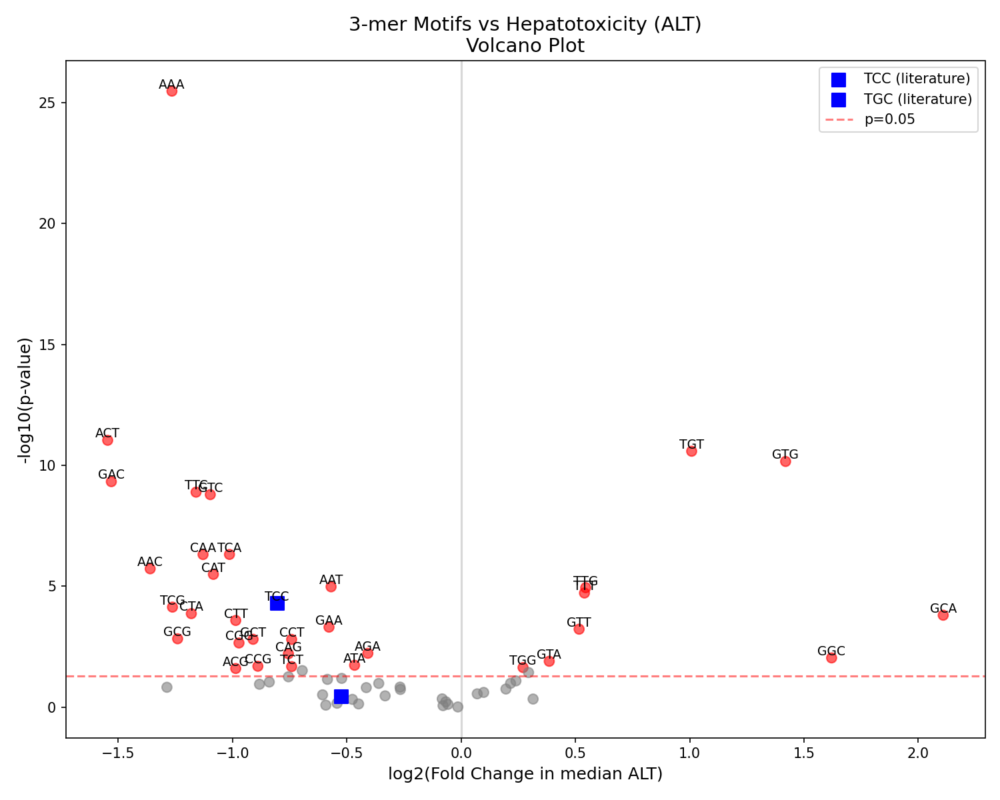
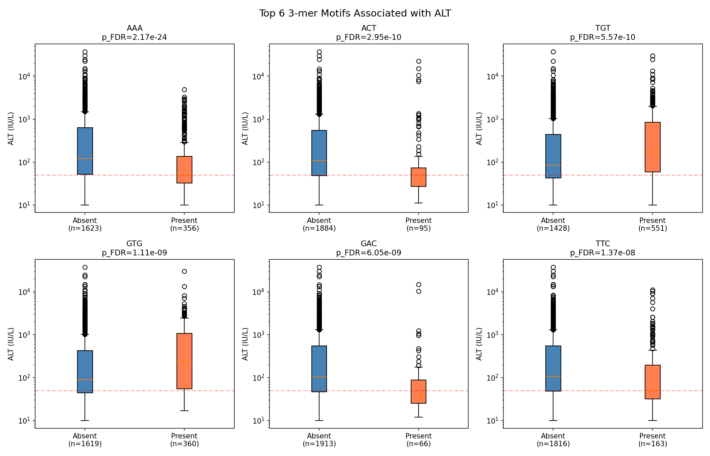
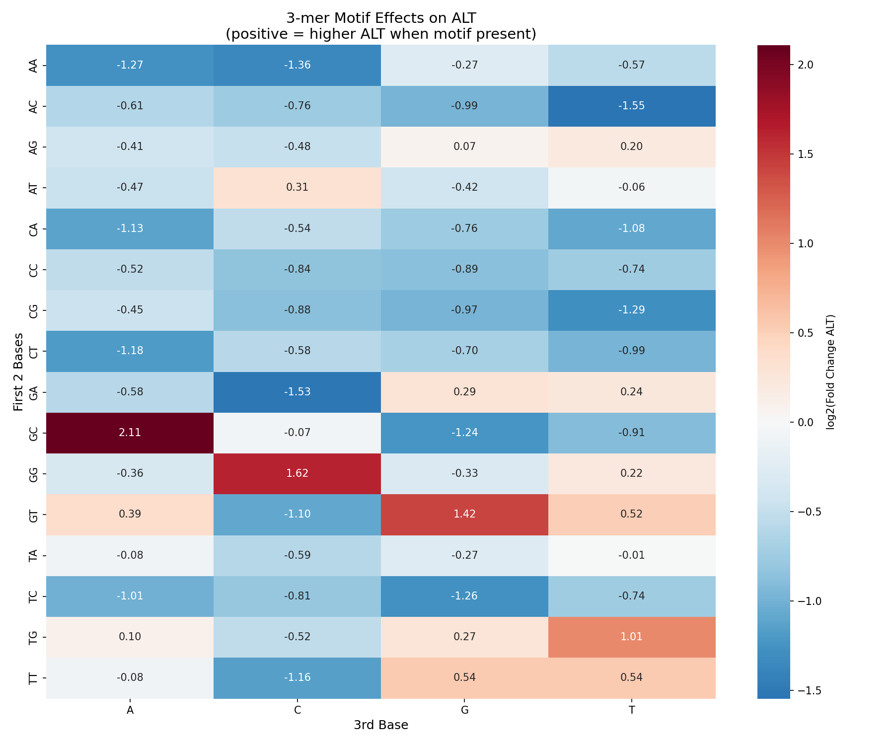
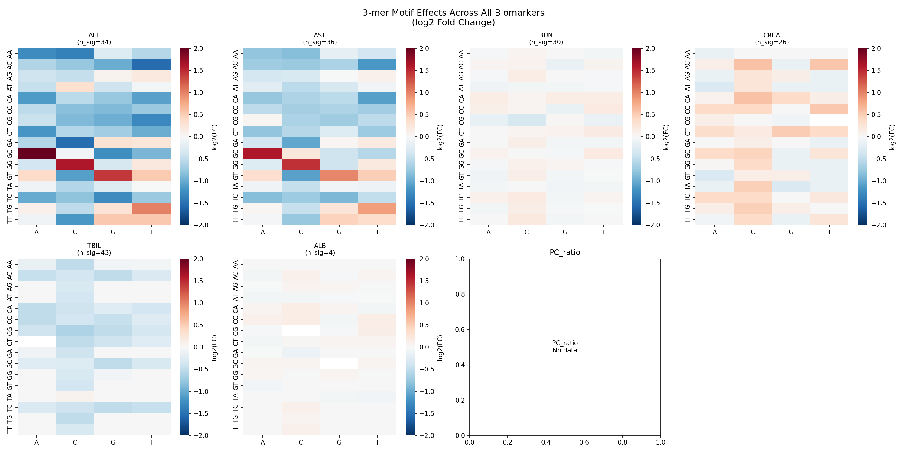
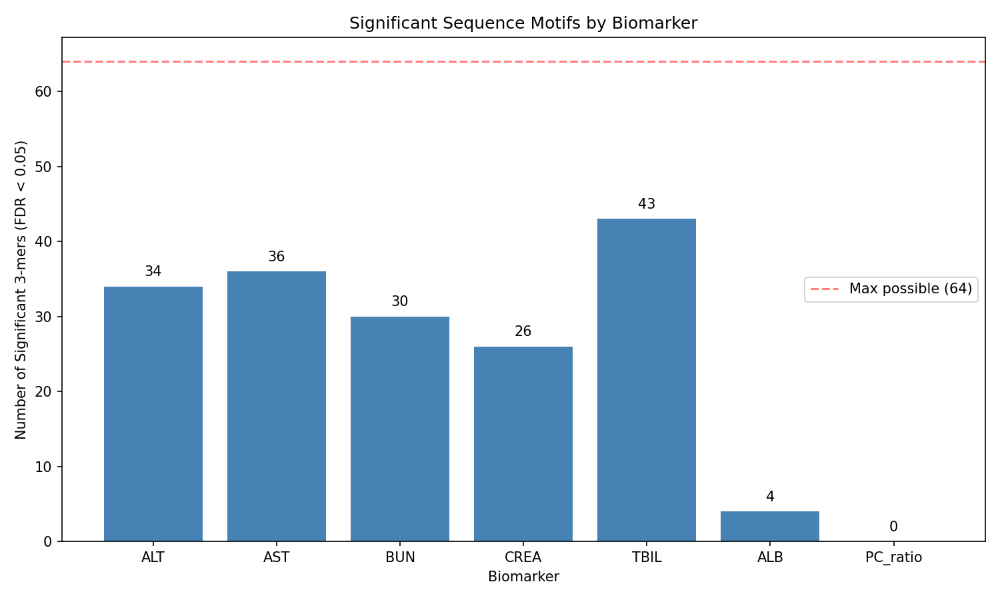

# Hypothesis 002: Sequence Motifs Drive ASO Hepatotoxicity

## Hypothesis

Specific trinucleotide (3-mer) sequence motifs are associated with ASO hepatotoxicity, independent of other sequence features like GC content and length.

## Rationale

Prior work by Burdick et al. (2014) identified TCC and TGC motifs as strongly associated with hepatotoxicity in LNA-modified ASOs. These motifs were found to increase protein binding and activate P53/NRF2 stress pathways. This analysis tests whether similar motif-toxicity relationships exist in our larger MOE gapmer dataset.

## Literature

- **Burdick AD et al. (2014)**. Sequence motifs associated with hepatotoxicity of locked nucleic acid-modified antisense oligonucleotides. *Nucleic Acids Research*. [PMC4005641](https://pmc.ncbi.nlm.nih.gov/articles/PMC4005641/)
  - Identified TCC and TGC as toxic motifs in LNA ASOs (n=71)
  - Found in 35% and 33% of toxic sequences respectively
  - Associated with increased hepatocellular protein binding

- **Dieckmann A et al. (2022)**. Identification of nucleobase chemical modifications that reduce the hepatotoxicity of gapmer antisense oligonucleotides. *Nucleic Acids Research*. [PMC9303313](https://pmc.ncbi.nlm.nih.gov/articles/PMC9303313/)
  - Chemical modifications can mitigate motif-associated toxicity
  - 2'-OMe at position 2 reduces protein interactions

## Methods

### Dataset
- **Source**: `data/oligostack/processed/hepatictoxicity_processed.parquet`
- **Filter**: Mouse, subcutaneous administration
- **N**: 1,979 unique ASOs with valid HELM, ALT, and covariate data

### Analysis
1. Extract base sequence from HELM annotations
2. Test all 64 possible 3-mers for association with ALT
3. **Univariate**: Mann-Whitney U test (motif present vs absent)
4. **Controlled**: Partial Spearman correlation adjusting for:
   - Dose (mg/kg)
   - GC content
   - Sequence length
5. **Multiple testing correction**: Benjamini-Hochberg FDR

## Results

### Summary
- **64** 3-mers tested
- **34** significant after FDR correction (q < 0.05) in univariate analysis
- **55** significant after controlling for confounders

### Top Pro-Toxic Motifs (↑ ALT)

| Motif | Fold Change | p_FDR | n_present |
|-------|-------------|-------|-----------|
| **GCA** | **4.31** | 5.6e-04 | 107 |
| **GGC** | **3.08** | 2.1e-02 | - |
| **GTG** | **2.67** | 1.1e-09 | 360 |
| **TGT** | **2.01** | 5.6e-10 | 551 |
| TTG | 1.46 | 5.6e-05 | 477 |
| TTT | 1.45 | 8.7e-05 | 628 |

### Top Protective Motifs (↓ ALT)

| Motif | Fold Change | p_FDR | n_present |
|-------|-------------|-------|-----------|
| **AAA** | **0.42** | **2.2e-24** | 356 |
| **ACT** | **0.34** | 3.0e-10 | 95 |
| **GAC** | **0.35** | 6.1e-09 | 66 |
| TTC | 0.45 | 1.4e-08 | 163 |
| GTC | 0.47 | 1.5e-08 | 123 |
| CAA | 0.46 | 3.5e-06 | 89 |

### Validation of Literature Motifs

| Motif | Literature (LNA) | This Study (MOE) | Interpretation |
|-------|------------------|------------------|----------------|
| **TCC** | Pro-toxic | **Protective** (0.57x, p=2.2e-04) | Chemistry-dependent |
| **TGC** | Pro-toxic | Not significant (p=0.38) | Not replicated |

### Controlled Analysis (Partial Correlations)

After adjusting for dose, GC content, and sequence length, the top motifs by partial correlation were:

| Motif | Partial ρ | p_FDR | Direction |
|-------|-----------|-------|-----------|
| TAC | +0.364 | 3.8e-61 | ↑ ALT |
| CGT | +0.327 | 4.1e-49 | ↑ ALT |
| CTA | +0.320 | 4.4e-47 | ↑ ALT |
| AAA | -0.315 | 1.3e-45 | ↓ ALT |
| GCA | +0.302 | 4.8e-42 | ↑ ALT |

## Figures

### Volcano Plot

Red points: FDR < 0.05. Blue squares: Literature motifs (TCC, TGC).

### Top Motifs Boxplots

### Motif Effect Heatmap

---

## Extended Analysis: All Biomarkers

Tested all 64 3-mers against all available biomarkers to identify if motif effects are liver-specific or systemic.

### Biomarkers Tested

| Biomarker | Description | N (ASOs) | Sig. Motifs |
|-----------|-------------|----------|-------------|
| **ALT** | Alanine aminotransferase (liver) | 1,979 | 34/64 |
| **AST** | Aspartate aminotransferase (liver/muscle) | 1,777 | 36/64 |
| **BUN** | Blood urea nitrogen (kidney) | 1,566 | 30/64 |
| **CREA** | Creatinine (kidney) | 759 | 26/64 |
| **TBIL** | Total bilirubin (liver) | 1,402 | 43/64 |
| **ALB** | Albumin (liver synthetic) | 871 | 4/64 |
| PC_ratio | Protein/creatinine (kidney) | 0 | - |

### Top Fold Changes Across All Biomarkers

| Biomarker | Motif | Fold Change | p_FDR | Direction |
|-----------|-------|-------------|-------|-----------|
| **ALT** | **GCA** | **4.31** | 5.6e-04 | ↑ |
| **ALT** | **GGC** | **3.08** | 2.1e-02 | ↑ |
| **AST** | **GCA** | **3.06** | 3.8e-03 | ↑ |
| ALT | ACT | 0.34 | 3.0e-10 | ↓ |
| ALT | GAC | 0.35 | 6.1e-09 | ↓ |
| AST | GGC | 2.75 | 3.6e-02 | ↑ |
| ALT | GTG | 2.67 | 1.1e-09 | ↑ |

### Key Observations

1. **Largest fold changes are in ALT** - liver-specific effects dominate
2. **AST mirrors ALT patterns** - both liver enzymes show similar motif effects
3. **Kidney markers (BUN, CREA) show smaller effects** - fold changes mostly 0.8-1.5x
4. **TBIL has many significant motifs but small effect sizes**
5. **ALB almost unaffected** - only 4 significant motifs, all near 1x
6. **No massive fold changes (>5x or <0.2x)** passed FDR correction

### Biomarker Heatmaps

### Significant Motifs by Biomarker

### Interpretation

The **GCA motif is consistently pro-toxic** across both ALT (4.31x) and AST (3.06x), making it the strongest candidate for a universal hepatotoxic sequence feature.

Kidney markers show different patterns - suggesting sequence-toxicity relationships are **organ-specific** and likely mediated by tissue-specific protein interactions.

## Conclusion

**Supported** - Sequence motifs are significantly associated with hepatotoxicity.

### Key Findings

1. **34 of 64 3-mers** show significant association with ALT after FDR correction
2. **AAA is the strongest protective motif** (0.42x ALT, p < 1e-24)
3. **GCA, GTG, TGT are pro-toxic** (2-4x ALT elevation)
4. **Literature motifs (TCC, TGC) do not replicate** in MOE gapmers:
   - TCC is actually protective in our dataset
   - TGC shows no significant effect
5. Effects persist after controlling for dose, GC content, and length

### Interpretation

The discrepancy with Burdick et al. likely reflects:
1. **Chemistry differences**: LNA vs MOE have different protein binding profiles
2. **Dataset size**: Our n=1,979 vs their n=71
3. **Target diversity**: Our dataset spans many gene targets

The protective effect of A-rich motifs (AAA, AAC, AAT) and toxic effect of TG-containing motifs (TGT, GTG) suggests that **purine/pyrimidine balance** may influence hepatotoxicity, possibly through differential protein binding or RNase H cleavage patterns.

### Follow-up Hypotheses

1. Are these motifs position-dependent (wing vs gap)?
2. Do A-rich sequences have lower protein binding?
3. Is there an interaction between motif and chemistry modification?
