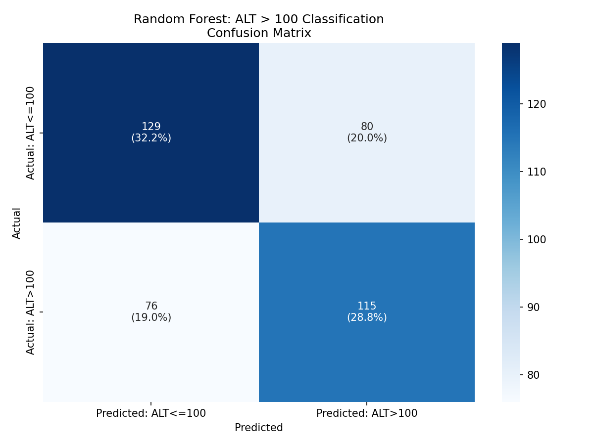
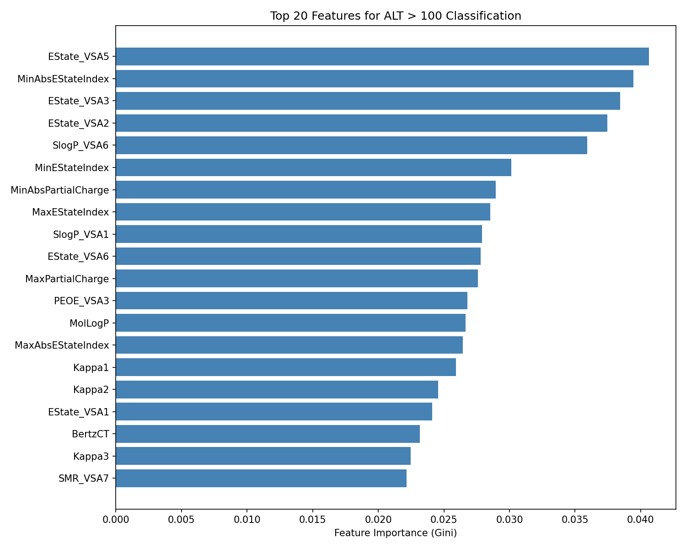

# Hypothesis 003: RDKit Molecular Descriptors Predict ASO Hepatotoxicity

## Hypothesis

Molecular descriptors calculated from nucleoside SMILES structures can predict ASO hepatotoxicity, enabling binary classification of ALT > 100 IU/L.

## Rationale

Different nucleoside modifications (DNA, MOE, cET, LNA, etc.) have distinct chemical properties that may influence hepatotoxicity:

1. **Lipophilicity** (MolLogP) affects cellular uptake and membrane interactions
2. **Polar surface area** (TPSA) influences protein binding
3. **Hydrogen bonding capacity** affects interactions with hepatocyte proteins
4. **Electrotopological state** (EState) captures electronic environment contributions

By summing descriptors across all nucleosides in an ASO, we capture the aggregate molecular profile.

## Methods

### Dataset
- **Source**: `data/oligostack/processed/hepatictoxicity_processed.parquet`
- **Processing**: HELM sequences parsed to nucleoside SMILES, 58 RDKit descriptors summed per ASO
- **N**: 1,999 unique ASOs with valid descriptors and ALT data

### Correlation Analysis (`analysis.py`)
- 58 RDKit molecular descriptors calculated per nucleoside, summed across sequence
- Spearman correlation with mean ALT
- Benjamini-Hochberg FDR correction

### Random Forest Classification (`rf_classifier.py`)
- **Target**: Binary ALT > 100
- **Features**: 58 RDKit descriptors (StandardScaler normalized)
- **Split**: 80% train / 20% test (stratified)
- **Model**: RandomForestClassifier (n_estimators=100, max_depth=10, class_weight='balanced')
- **Evaluation**: 5-fold cross-validation, confusion matrix, feature importance

## Results

### Correlation Analysis

Top significant correlations (FDR < 0.05):

| Descriptor | Spearman rho | p_FDR | Direction |
|------------|-------------|-------|-----------|
| EState_VSA3 | -0.304 | 1.9e-41 | Lower ALT |
| MinAbsEStateIndex | -0.289 | 1.4e-37 | Lower ALT |
| PEOE_VSA3 | -0.278 | 6.1e-35 | Lower ALT |
| SlogP_VSA2 | -0.273 | 1.1e-33 | Lower ALT |
| EState_VSA2 | +0.266 | 3.6e-32 | Higher ALT |

48 of 58 descriptors showed significant correlation (FDR < 0.05).

### Random Forest Classification

| Metric | Value |
|--------|-------|
| CV Accuracy (5-fold) | 0.651 +/- 0.016 |
| Test Accuracy | 0.610 |
| Precision | 0.590 |
| Recall | 0.602 |
| F1 Score | 0.596 |

**2x2 Confusion Matrix (Test Set, n=400):**

|                   | Predicted ALT<=100 | Predicted ALT>100 |
|-------------------|-------------------|-------------------|
| **Actual ALT<=100** | 129 (TN) | 80 (FP) |
| **Actual ALT>100**  | 76 (FN) | 115 (TP) |

#### Confusion Matrix

#### Feature Importance

## Conclusion

**Partially Supported** - RDKit molecular descriptors provide modest predictive power for ALT > 100 classification (61% accuracy vs 50% baseline). The model performs above chance but has limited clinical utility. Key predictive features include EState_VSA descriptors and molecular weight, consistent with the correlation analysis showing strong associations between electrotopological properties and hepatotoxicity.

## Files

- `analysis.py` - Correlation analysis between RDKit descriptors and ALT
- `rf_classifier.py` - Random forest binary classification for ALT > 100
- `rdkit_descriptor_data.csv` - Pre-computed feature data (1,999 ASOs x 58 descriptors)
- `rdkit_descriptor_correlations.csv` - Spearman correlation results
- `feature_importance.csv` - Random forest feature importance rankings
- `figures/` - Confusion matrix and feature importance plots
