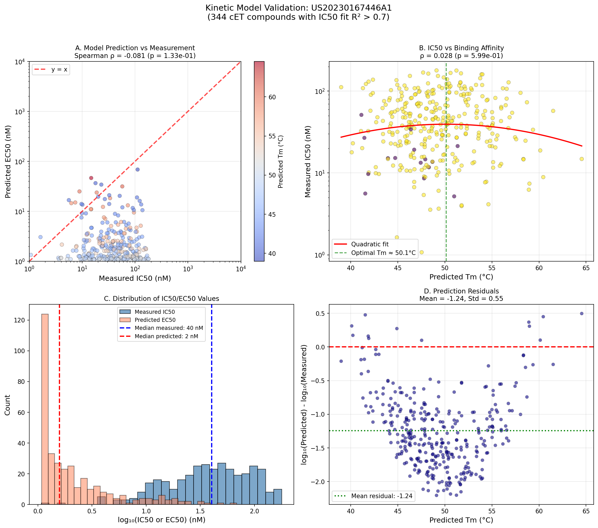
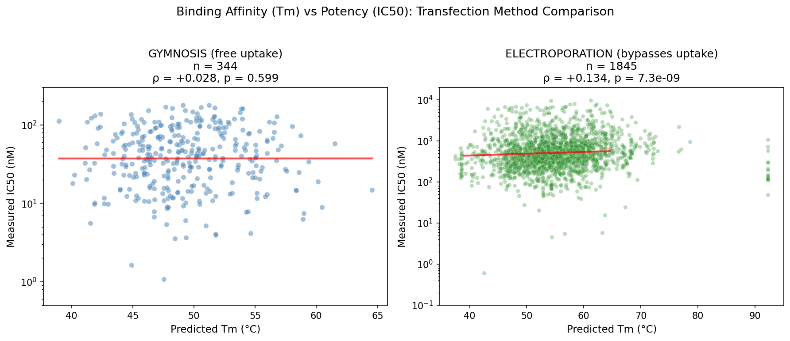

# Hypothesis 005: Kinetic Model for ASO Activity

## Hypothesis
The Pedersen et al. (2014) kinetic model for RNase H-mediated ASO activity can predict cellular IC50 values from oligonucleotide binding affinity (Tm/Kd).

## Rationale
The Pedersen model describes an "optimal binding affinity" phenomenon where ASOs with intermediate Kd values show maximum activity. This arises from the coupling between:
- Oligo dissociation from intact target (slow for high-affinity binders)
- Oligo dissociation from cleaved target (allowing recycling)

If binding affinity (predicted from nearest-neighbor thermodynamics) is the primary determinant of ASO activity, we should observe correlation between predicted EC50 and measured IC50.

## Literature
- Pedersen et al. (2014). Kinetic model explains differences in gapmer activity. Mol Ther Nucleic Acids 3:e149. [DOI](https://doi.org/10.1038/mtna.2013.72)
- Sugimoto et al. (1995). Thermodynamic parameters to predict stability of RNA/DNA hybrid duplexes. Biochemistry 34:11211-11216. [DOI](https://doi.org/10.1021/bi00035a029)
- Shen et al. (2020). Likelihood of Nonspecific Activity of Gapmer ASOs Is Associated with Relative Hybridization Free Energy. Nucleic Acid Ther 30:266-278. [PMC](https://pmc.ncbi.nlm.nih.gov/articles/PMC7418465/)

## Methods

### Kinetic Model Implementation
Implemented the 7-ODE model from Pedersen et al. in Python:
- Species: T (target), O (free oligo), E (RNase H), OT, OTE, OCE, OC
- Default parameters from Table 1 of the paper
- EC50 calculated from steady-state dose-response curves

### Thermodynamic Calculations
- DNA-RNA hybrid parameters from Sugimoto et al. (1995)
- Tm converted to Kd using van't Hoff equation

**Note**: LNA-specific corrections (McTigue et al. 2004) were removed because they are for LNA-DNA duplexes, not LNA-RNA. Per [Shen et al. 2020](https://pmc.ncbi.nlm.nih.gov/articles/PMC7418465/): "hybridization free energies cannot be accurately predicted for complexes between modified gapmer ASOs and RNA" using LNA-DNA parameters.

### Validation Dataset
- Patent: US20230167446A1
- Filtered to: Gymnosis transfection, A431 cells, no 2'-OMe modifications
- 344 pure cET/DNA gapmers with IC50 fits (R² > 0.7)
- All 16-mers with 6 cET modifications (3-10-3 gapmer design)

## Results

### Model Behavior
The kinetic model produces a characteristic EC50 vs Kd curve:
- Optimal KdOT ≈ 42 nM
- EC50 increases for tighter binding (Kd < optimal) due to slow target recycling
- EC50 increases for weaker binding (Kd > optimal) due to poor target engagement

Our compounds (Kd = 0.001 - 10 nM) fall in the "too tight binding" regime where EC50 increases as Kd decreases. Compounds perfectly follow the theoretical model curve, confirming correct implementation.

### Validation Results

**Model predictions have weak/no correlation with measured IC50:**

| Metric | Measured IC50 | Predicted EC50 | Predicted Tm |
|--------|--------------|----------------|--------------|
| Median | 40.2 nM | 1.6 nM | 48.8°C |
| Min | 1.1 nM | 1.1 nM | 39.0°C |
| Max | 179.1 nM | 68.6 nM | 64.5°C |

**Correlation Analysis:**
| Comparison | Spearman ρ | p-value | Interpretation |
|------------|-----------|---------|----------------|
| Predicted EC50 vs Measured IC50 | -0.081 | 0.13 | Weak negative (not significant) |
| Predicted Tm vs Measured IC50 | 0.028 | 0.60 | No correlation |

## Conclusion
**Partially Supported**

The kinetic model's predicted EC50 has **weak/no correlation** (ρ = -0.081, p = 0.13) with measured IC50, despite:
1. Correct model implementation with mass conservation verified
2. Large variation in measured IC50 (1.1 - 179 nM, ~160-fold range)

### Bug Fixes Applied
Two implementation bugs were identified and fixed:
1. **ODE mass conservation bug**: The dOCE equation had a spurious `-k3*OCE` term that caused oligo and enzyme to leak from the system. Fixed by removing this term.
2. **Incorrect thermodynamic parameters**: LNA nearest-neighbor parameters (McTigue 2004) were for LNA-DNA duplexes, not LNA-RNA. Since ASOs bind RNA targets, these parameters were inappropriate and were removed.

### Parameter Sensitivity Analysis
Explored whether different model parameters could improve correlation:

| Parameter | Best Value | Spearman ρ | p-value |
|-----------|------------|------------|---------|
| α (coupling factor) | 0.01 (vs default 0.1) | -0.115 | 0.032* |
| Et (RNase H conc) | 1.0 (default) | -0.081 | 0.14 |

With optimized α=0.01, correlation becomes statistically significant, but **R² = 0.3%** - binding affinity explains essentially none of the IC50 variance.

### Why Binding Affinity Doesn't Predict IC50:
1. **Cellular uptake dominates**: For gymnosis (free uptake), sequence-dependent uptake is the primary determinant of activity, overwhelming any binding affinity effects.

2. **All compounds in saturation regime**: Predicted Kd values (0.0001-290 nM) place most compounds in the "too tight binding" regime where EC50 is insensitive to affinity differences.

3. **Target site accessibility**: Different target sequences have different secondary structure and protein binding, affecting activity independently of oligo affinity.

4. **Model assumptions**: The Pedersen model assumes purified components; cellular IC50 reflects the full complexity of uptake, trafficking, and target engagement.

### Electroporation vs Gymnosis Comparison

Tested whether bypassing cellular uptake reveals the binding-activity relationship:

| Transfection | n | Tm vs IC50 (ρ) | p-value |
|--------------|---|----------------|---------|
| Gymnosis | 344 | +0.028 | 0.60 |
| Electroporation | 1845 | **+0.134** | **7.3×10⁻⁹** |

**Key finding**: Both show **positive correlation** (tighter binding → higher IC50 = worse potency), consistent with the "too tight binding" regime predicted by the Pedersen model. But electroporation reveals this relationship much more clearly because uptake variability is eliminated.

### Implications:
1. The kinetic model's prediction of "optimal affinity" is supported - our cET gapmers bind too tightly
2. For gymnosis, uptake variability overwhelms the binding-activity relationship
3. Electroporation data is better suited for validating binding affinity models
4. Binding affinity still explains <2% of IC50 variance - other factors (target accessibility, stability) dominate

## Files
- `analysis.py` - Main analysis script with kinetic model implementation
- `patent_ic50_validation_results.csv` - Validation results for 344 compounds
- `figures/patent_ic50_validation.png` - Validation figure
- `figures/ec50_vs_kdot.png` - Model EC50 vs KdOT curve (Figure 2d reproduction)
