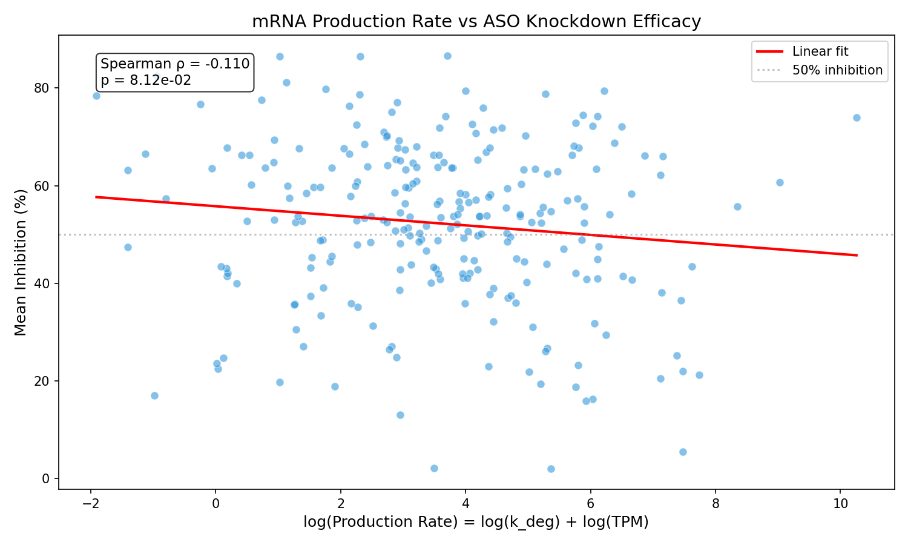
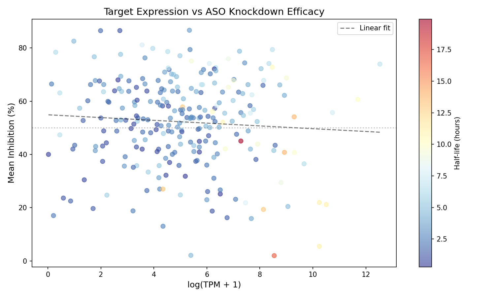
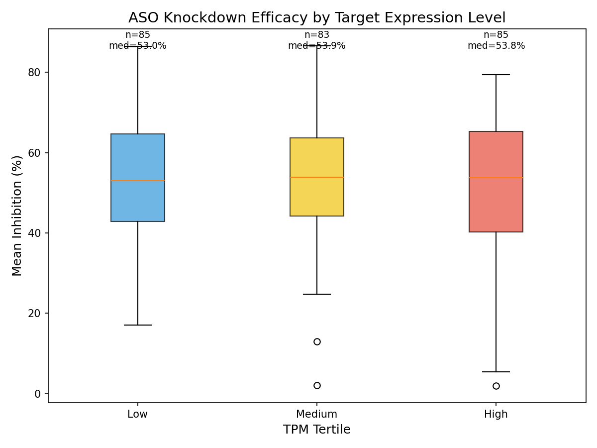
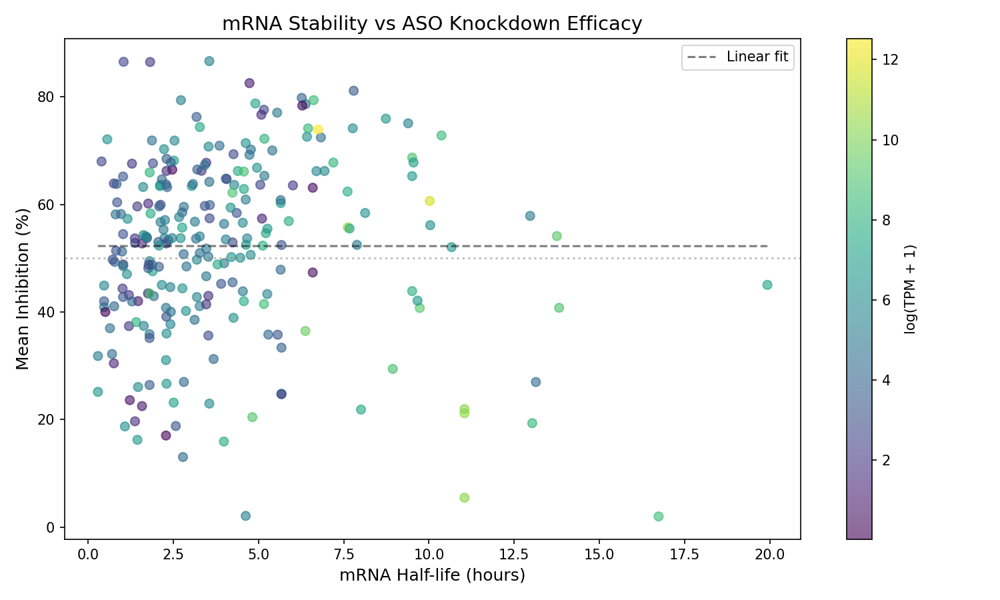
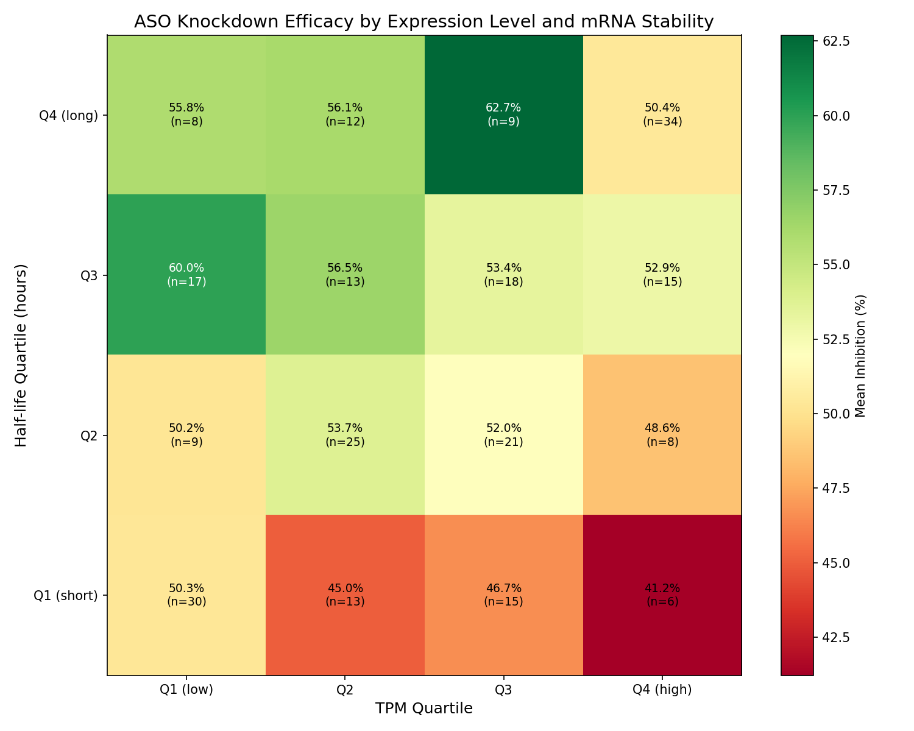

# Hypothesis 006: mRNA Production Rate vs ASO Knockdown Efficacy

## Hypothesis
Genes with higher mRNA production rates (approximated by expression level and degradation rate) show different knockdown efficacy with ASOs.

At steady state: **Production rate = degradation rate x abundance = (ln(2) / half-life) x TPM**

## Rationale
ASO-mediated knockdown involves hybridization to target mRNA followed by RNase H cleavage. Several factors could influence efficacy:

1. **Higher expression** = more target molecules for ASO binding, potentially higher absolute knockdown
2. **Faster mRNA turnover** = target is naturally being degraded faster, may synergize with ASO action
3. **Slower turnover** = mRNA persists longer, providing more time for ASO binding

The interplay between expression level and mRNA stability could determine whether an ASO achieves effective knockdown of its target.

## Mathematical Derivation

At steady state, the rate of mRNA change is zero:

```
d[mRNA]/dt = 0 = k_prod - k_deg x [mRNA]
k_prod = k_deg x [mRNA] = (ln(2) / half_life) x TPM
```

### Using RNAdecayCafe half-life data

RNAdecayCafe provides real half-life values in hours and pre-computed log degradation rates:

```
k_deg = ln(2) / halflife_hours
log(k_deg) = donorm_log_kdeg  (directly from RNAdecayCafe)
```

### Production rate formula

Since TPM is stored as log(TPM+1):

```
Production = k_deg x TPM
log(Production) = log(k_deg) + log(TPM)
                = donorm_log_kdeg + log_tpm
```

**Key insight**: Use `donorm_log_kdeg` directly from RNAdecayCafe - no conversion needed.

## Literature

- Lai et al. (2024). Evaluation of multiple-turnover capability of locked nucleic acid antisense oligonucleotides. *Nucleic Acids Res*. [PMID: 24758560](https://pubmed.ncbi.nlm.nih.gov/24758560/)
  - Key finding: In vivo ASO efficacy correlated with turnover efficiency; intracellular conditions resemble multiple-turnover kinetics

- Bhaya et al. (2013). Antisense-mediated transcript knockdown. *Mol Cell*. [PMID: 31924448](https://pubmed.ncbi.nlm.nih.gov/31924448/)
  - Key finding: ASOs act on nascent transcripts and induce premature transcription termination via XRN2

- Lima et al. (2004). Identification of sequence motifs correlated with antisense activity. *Nucleic Acids Res*. [PMID: 10908347](https://pubmed.ncbi.nlm.nih.gov/10908347/)
  - Key finding: Statistical analysis of >1000 experiments identified motifs positively and negatively correlated with antisense efficiency

- Laird-Offringa et al. (2000). Antisense oligonucleotide targeting of 3'-UTR. *Methods Mol Biol*. [PMID: 30171537](https://pubmed.ncbi.nlm.nih.gov/30171537/)
  - Key finding: 3'-UTR targeting affects mRNA stability, transport, and translation efficiency

## Methods

### Data Sources
| Data | Source | Description |
|------|--------|-------------|
| TPM | CCLE OmicsExpressionTPMLogp1 | log(TPM+1) expression per gene-cell line |
| Half-life | RNAdecayCafe v1 | Real half-life values (hours), dropout-normalized |
| Inhibition | OligoStack (in vitro) | % mRNA knockdown with CCLE cell mapping |

### Half-life Data Processing
- Source: `data/RNAdecayCafe_v1_onetable.csv.gz` (~657K rows, 13 cell lines)
- Quality filter: `uncertainty_log_kdeg < 0.3`
- Aggregation: Median across all cell lines per gene
- Rationale: mRNA half-life is primarily cis-encoded (UTR elements, codon usage), conserved across cell types

### Filters Applied
- Species: Human cells only
- Cell lines with CCLE model ID mapping
- Genes with both TPM and half-life data available

### Statistical Tests
1. **Spearman correlation**: TPM vs inhibition, half-life vs inhibition, log(k_deg) vs inhibition
2. **Mann-Whitney U**: Median-split comparisons
3. **OLS regression**: Multivariate with TPM, log(k_deg), and dose

## Results

### Dataset Summary
- Half-life lookup (RNAdecayCafe): **16,932 genes**
- Final dataset: **242 gene-cell pairs** (209 unique genes, 20 cell lines)

### Summary Statistics
| Metric | Mean | Std |
|--------|------|-----|
| log(TPM+1) | 5.10 | 2.25 |
| Half-life (hours) | 4.0 | 3.1 |
| log(k_deg) | -1.49 | 0.77 |
| Mean inhibition | 52.5% | 16.7% |

### Statistical Tests

| Test | Statistic | p-value | Interpretation |
|------|-----------|---------|----------------|
| Spearman (TPM) | rho = -0.036 | 0.58 | No correlation with expression level |
| Spearman (half-life) | rho = +0.189 | **3.2e-03** | Longer half-life -> higher knockdown |
| Spearman (log k_deg) | rho = -0.190 | **3.0e-03** | Faster degradation -> lower knockdown |
| Spearman (log production) | rho = -0.108 | 0.095 | Weak trend, not significant |
| Mann-Whitney (TPM) | U = 7065 | 0.64 | No difference by expression |
| Mann-Whitney (half-life) | U = 8968 | **2.5e-03** | Long half-life genes show higher knockdown |
| OLS (R^2 = 0.020) | - | - | Weak multivariate effect |
| - TPM coefficient | -0.92 | 0.28 | No significant effect |
| - log(k_deg) coefficient | +0.33 | 0.91 | No significant effect |

### Key Finding
**mRNA half-life is significantly associated with knockdown efficacy**: Genes with longer mRNA half-lives (>= 3.3h) show ~5% higher knockdown (median 57.4% vs 52.4%, p = 0.0025).

The relationship is consistent with the z-score based analysis but now uses real kinetic parameters (hours) from RNAdecayCafe.

### Figures

#### Production Rate vs Inhibition (Primary Hypothesis Test)

*Scatter plot showing log(production rate) vs knockdown efficacy. Production rate = log(k_deg) + log(TPM).*

#### TPM vs Inhibition

*Scatter plot showing target expression level vs knockdown efficacy, colored by mRNA half-life (hours).*

#### Inhibition by TPM Tertile

*Boxplot comparing knockdown across low, medium, and high expression targets.*

#### Half-life vs Inhibition

*Scatter plot showing mRNA stability (hours) vs knockdown efficacy, colored by expression level.*

#### TPM x Half-life Heatmap

*2D heatmap showing mean inhibition across expression and stability quartiles.*

## Conclusion
**Partially Supported**

The hypothesis is partially supported with findings consistent with the previous z-score based analysis:

1. **mRNA half-life matters**: Genes with longer half-lives (>=3.3h) show significantly better knockdown (rho=+0.19, p=0.003). This may reflect:
   - Longer-lived mRNAs provide more time for ASO binding
   - Fast-turnover mRNAs may be degraded before ASO can act

2. **Expression level has no effect**: TPM alone shows no correlation with knockdown efficacy, consistent with the previous analysis.

3. **Production rate (log_kdeg + log_tpm)**: The combined production metric shows a weak negative trend (rho=-0.11, p=0.095) but is not statistically significant with real kinetic values. This differs from the z-score analysis where the trend was stronger, possibly due to:
   - Real half-life values having different variance structure than z-scores
   - The production rate calculation now uses proper units (hours) rather than normalized values

**Biological interpretation**: ASOs may be most effective against stable, moderately expressed transcripts where the target persists long enough for ASO binding. The real half-life values from RNAdecayCafe (mean 4.0h, range ~0.5-50h) provide interpretable kinetic parameters for downstream modeling.

**Data quality improvement**: RNAdecayCafe provides 16,932 genes with real half-life values in hours, compared to z-score normalized values from Agarwal & Kelley. The dropout-normalized values enable cross-dataset comparability and direct use in kinetic models.
