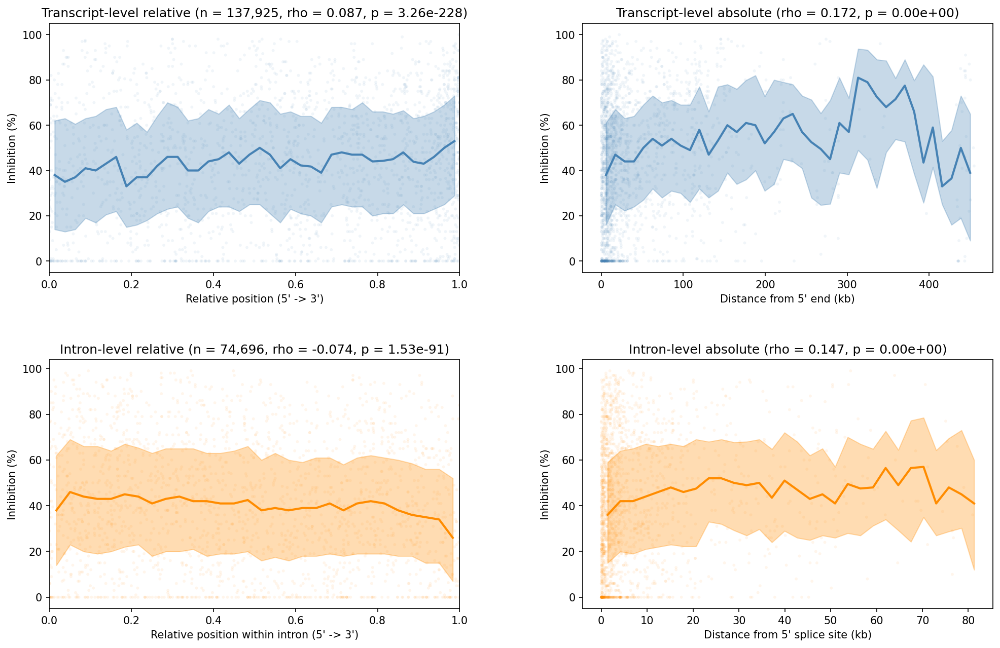

# Hypothesis 008: ASO 5' Positional Bias

## Hypothesis
Gapmer ASO efficacy decreases with distance from the 5' end of transcripts, consistent with a co-transcriptional accessibility model where nascent RNA near the 5' end is more accessible because it hasn't yet folded or been packaged.

## Rationale
During transcription, the 5' end of the nascent pre-mRNA is synthesized first and may be transiently accessible before RNA-binding proteins and secondary structures form. ASOs targeting the 5' region could therefore have greater access to their target sites. If true, this would predict a negative correlation between ASO position along the transcript and knockdown efficacy.

## Literature
- Vickers et al. (2020). Mind the Gapmer: Implications of Co-transcriptional Cleavage by Antisense Oligonucleotides. *Molecular Cell*. [PMID: 32142690](https://pubmed.ncbi.nlm.nih.gov/32142690/)
  - Key finding: ASOs targeting nascent transcripts induce premature transcription termination downstream of cleavage, but 3'-targeting gapmers do not trigger Pol II termination. Position along the transcript fundamentally alters the mechanism of ASO activity.
- Ho et al. (1998). Mapping of RNA Accessible Sites for Antisense Experiments with Oligonucleotide Libraries. *Nature Biotechnology*. [DOI: 10.1038/nbt0198-59](https://www.nature.com/articles/nbt0198-59)
  - Key finding: Position-dependent accessibility on target mRNA is a critical determinant of ASO efficacy; gene-walking approaches often yield inactive oligonucleotides.
- Patzel & Sczakiel (2000). Effects of RNA Secondary Structure on Cellular Antisense Activity. *Nucleic Acids Research*. [PMID: 10684928](https://pubmed.ncbi.nlm.nih.gov/10684928/)
  - Key finding: Local RNA structure at the target site is a major determinant of ASO binding; regions with high structural volatility are superior targets.
- Aartsma-Rus et al. (2009). Guidelines for Antisense Oligonucleotide Design. *Molecular Therapy*. [PMID: 18813282](https://pubmed.ncbi.nlm.nih.gov/18813282/)
  - Key finding: For splice-modulating ASOs, positioning closer to the acceptor splice site (5' of exon) led to higher exon skipping efficiency.

## Methods
- Dataset: 137,925 unique ASOs across 316 transcripts (in vitro inhibition data with genomic coordinates)
- ASO positions mapped to pre-mRNA (genomic span), with relative position `rel_pos = aso_start / pre_mRNA_length`
- Exon/intron classification from canonical transcript GTF (302 transcripts matched)
- Statistics: Spearman correlation, Mann-Whitney U for 5' vs 3' half comparisons

## Results

### Panel A: Transcript positional bias

| Test | Statistic | p-value | Interpretation |
|------|-----------|---------|----------------|
| Spearman (all ASOs) | rho = +0.088 | 2.6e-233 | 3' ASOs slightly more effective |

### Panel B: Intron positional bias

| Test | Statistic | p-value | Interpretation |
|------|-----------|---------|----------------|
| Spearman (intronic ASOs) | rho = -0.074 | 2.9e-90 | Within introns, 5' end slightly more effective |

### Panel C: Gene-length stratification (5' half vs 3' half)

| Gene length | 5' mean | 3' mean | Delta | MWU p-value |
|-------------|---------|---------|-------|-------------|
| <10kb | 36.5% | 40.1% | -3.5% | 3.7e-23 |
| 10-30kb | 36.9% | 42.5% | -5.6% | 1.5e-77 |
| 30-60kb | 38.8% | 41.1% | -2.3% | 2.4e-05 |
| 60-100kb | 47.5% | 51.9% | -4.4% | 1.7e-18 |
| >100kb | 46.4% | 49.5% | -3.1% | 4.3e-26 |

## Conclusion
**Opposite**

The co-transcriptional accessibility model is **not supported** at the whole-transcript level. ASOs targeting the 3' half of pre-mRNAs show consistently higher knockdown than 5'-targeting ASOs (rho = +0.088, p < 10^-200), with the effect present across all gene-length bins (delta = -2.3% to -5.6%).

However, **within introns**, a weak but significant 5' bias exists (rho = -0.074, p < 10^-89), suggesting that accessibility dynamics may differ between intronic and exonic regions.

The dominant 3' bias could reflect: (1) mature mRNA structure being more open near the 3' UTR and poly(A) tail, (2) 3' regions having lower protein occupancy in steady-state mRNA pools, or (3) 3' ASOs triggering more efficient RNase H cleavage due to the proximity to transcript termini (Vickers et al. 2020). The effect size is small (rho ~ 0.09), suggesting position explains only a minor fraction of efficacy variance.
